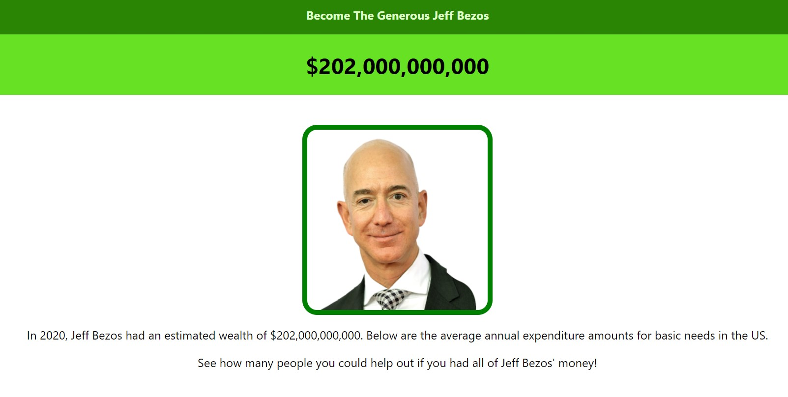

<h2 align="center"><u>Become-The-Generous-Bezos</u></h2>

<h4 align="center"> You have Jeff Bezos' wealth. See how you can help the people. </h4>

<h4 align="center"> Production Build: <a href="https://become-the-generous-bezos.isaaclee121.repl.co/">https://become-the-generous-bezos.isaaclee121.repl.co/</a> </h4>

    

 

### Description
Jeff Bezos' approximated wealth was estimated to be $202 billion in 2020 [<a src="https://www.cnn.com/2020/08/27/tech/jeff-bezos-net-worth-200-billion-intl-hnk/index.html">source</a>]

In 2020, the average American spent the following on each item: 

- Rent & Utilities: $21,409
- Food: $7,316
- Transportation: $9,826	
- Healthcare: $5,177
- Entertainment: $2,912
- Personal Care: $646	
- Education: $1,271
- Apparel Costs: $1,434
- TOTAL: $49,991

[<a src="https://www.bls.gov/opub/reports/consumer-expenditures/2020/home.htm">source</a>]

See how many people's expenses you could pay for if you had Jeff Bezos' money! 
### Disclaimer 
This is not meant to be a journalistically accurate tool in any way shape or form.
Data is from 2020 as there if more data was available from that year.

### Find me on 

<a href="https://www.linkedin.com/in/isaac-lee-621873133/">LinkedIn</a>
<a href="https://isaaclee.org/">Portfoilo Website</a>